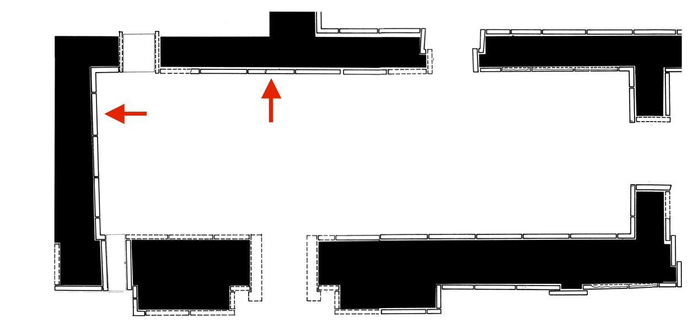
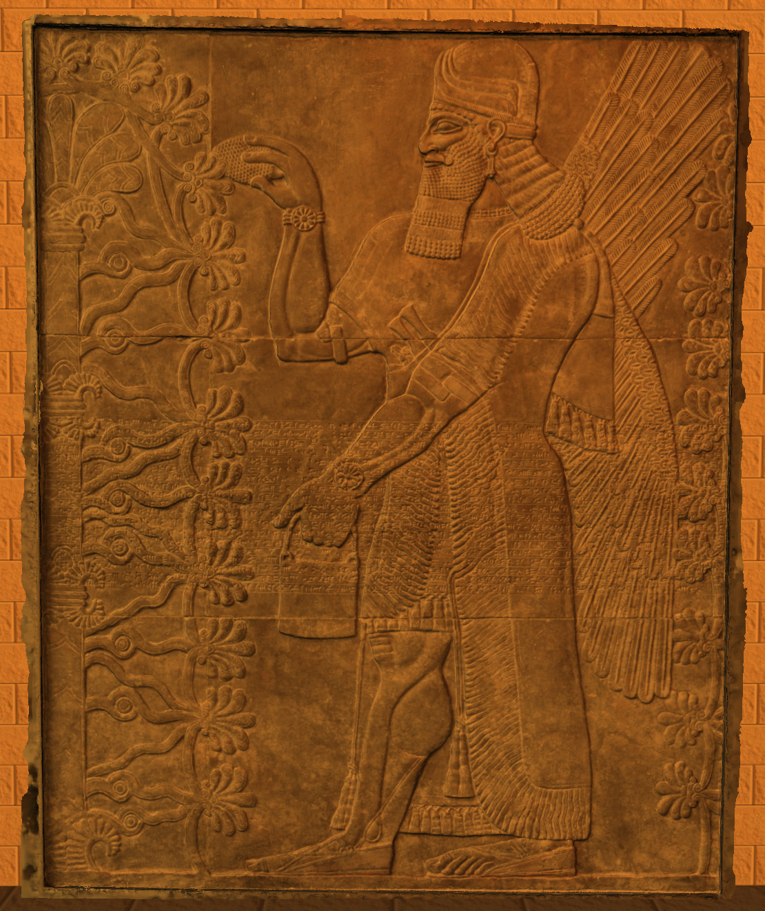
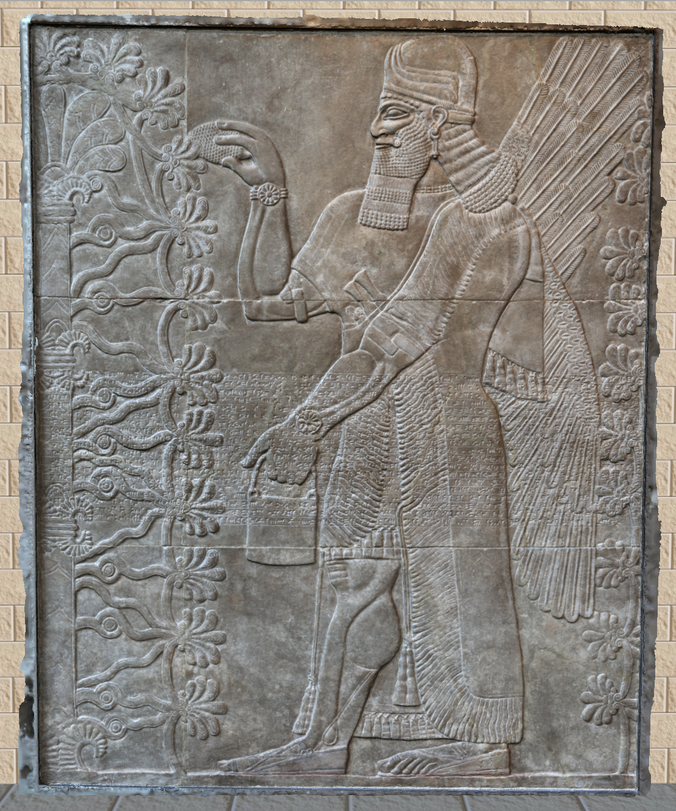
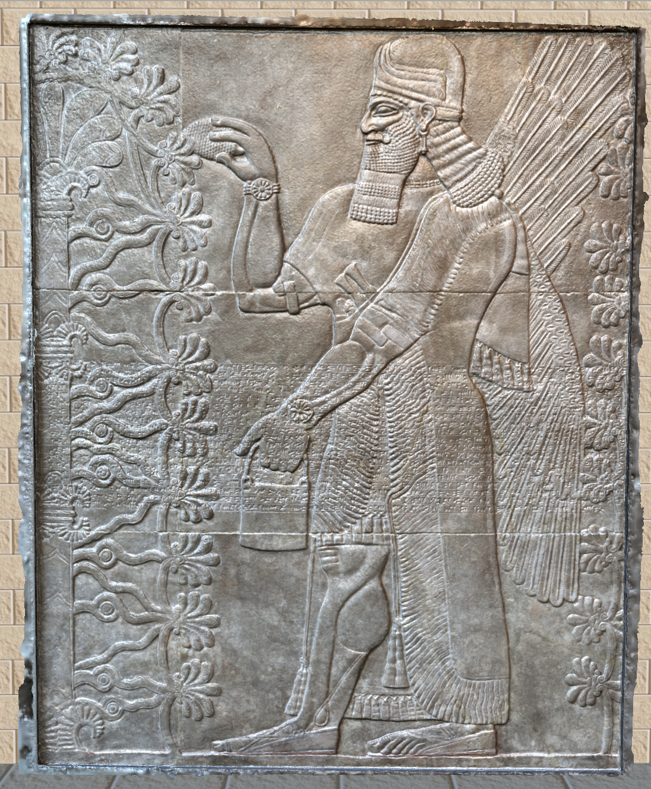
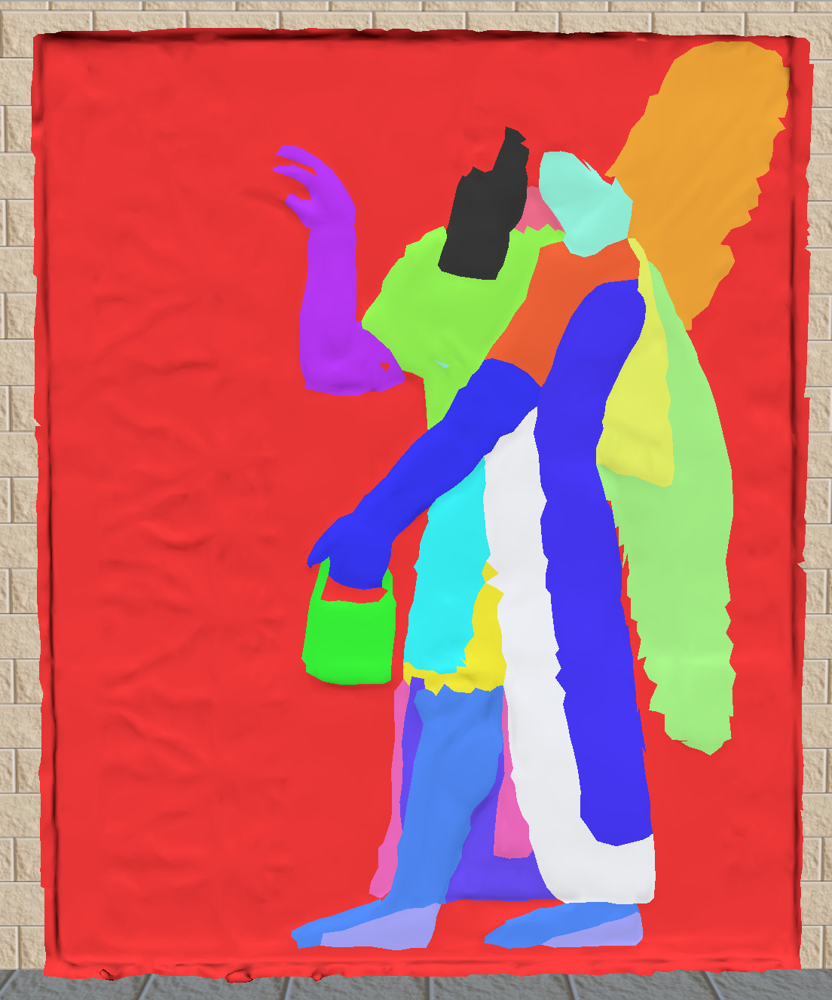

## Reconstruction and Lighting of Assyrian Palace Reliefs

### Introduction

This project focused on creating high resolution 3D models of Assyrian stone reliefs and placing them into a 3D scene of a room from the Northwest Palace in the ancient city of Nimrud. You can test out the scene yourself by clicking on the following link: [Link to Scene](https://nl384.github.io/nimrud_relief/nimrud_relief.html)

### Floorplan

The room in the scene and the placement of the models in the scene are based on the floorplan of the room in the Northwest palace (see image below). 

### Scene Viewer

The scene viewer gives the user a variety of ways to interact with the scene. First of all, the user has a variety of lighting options that they can use to light the scene in different ways. For instance, the user can choose to light up the scene with a torchlight (as in the first image below), or with sunlight (as in the second image below). In addition, the user can toggle an “exaggerated shading” effect to bring out more detail in the reliefs (see the third image below). 

The users can also navigate throughout the scene by using the WASD keys to move around, by clicking and dragging the cursor the look around, and by using the scroll wheel to zoom in and out. 

### Future Work

In addition, there are still some experimental aspects in the scene. For instance, the user can toggle an option to replace the relief with a colored relief. This colored relief is currently a placeholder. Hopefully with future input from art experts in the field, we hope to be able to color the reliefs in a historically accurate way. 

You can test out the scene yourself by clicking on the following link: [Link to Scene](https://nl384.github.io/nimrud_relief/nimrud_relief.html)